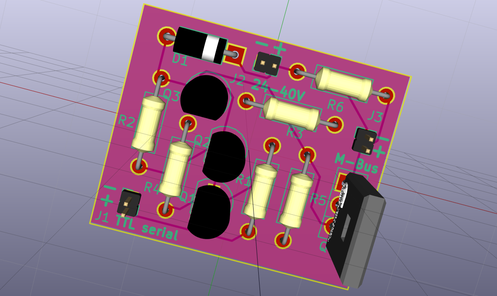

# Overview

This board can be used to simulate a M-Bus master unit instead of
connecting to the real AMS unit, i.e. usable for test and development.
It takes a 5 V TTL level input (serial) signal and converts it
to a M-bus level signal. It only supports sending. Based on
[MBus_USB.pdf](https://github.com/rscada/libmbus/blob/master/hardware/MBus_USB.pdf)1.
It depends on an external power source capable of delivering 25-40 Volt.
Most DC-DC boost/step-up converter modules2 should be fine for this.

## BOM

* D1 13V zener
* Q1-Q3 NPN transistor
* Q4 PNP transistor
* R1 1k
* R2 6.8k
* R3 1 (optional, can be shorted instead)
* R4 150
* R5 22k
* R6 220k

Note for the zener. This board depends on the zener to operate below 1mA,
e.g. like 1N5350 whereas a BZX55 will probably not operate properly.

 

This could be accomplished by reducing the 22k resistor so that it
draws enough current.

-------------

1
See also https://electronics.stackexchange.com/questions/99388/designing-a-m-bus-master-up-to-10-slaves/ and https://electronics.stackexchange.com/a/214477/568.

2
Like for instance [this one](http://hobbycomponents.com/power/698-xl60009-dc-dc-step-up-boost-converter) for £3.
