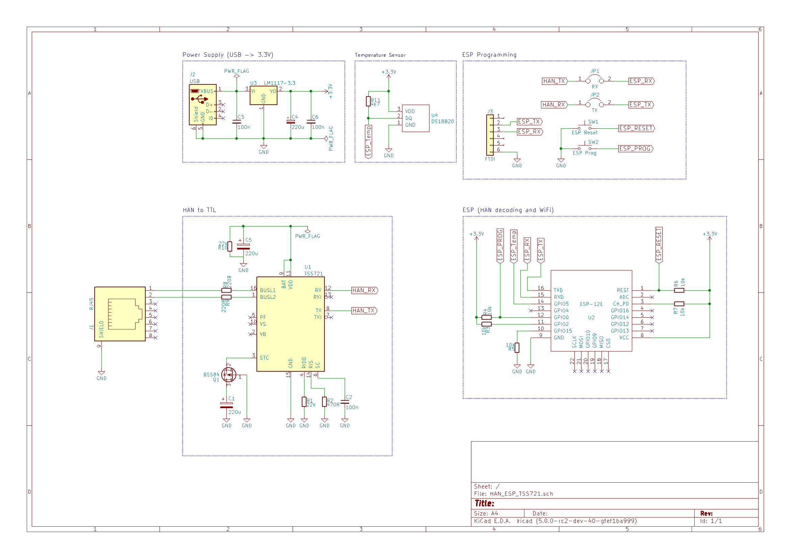
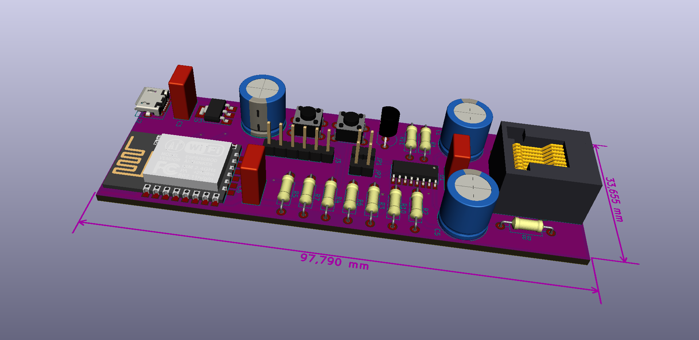
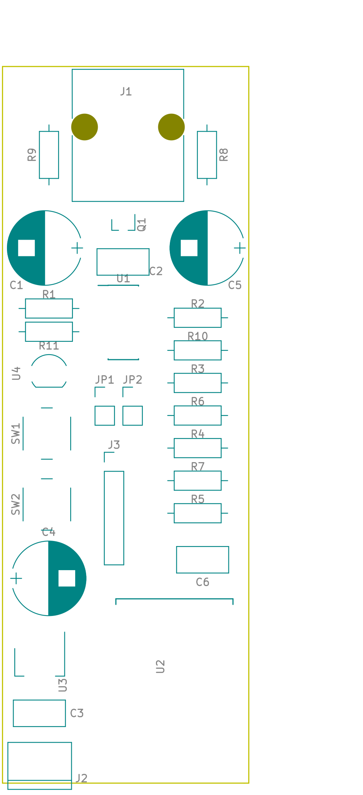
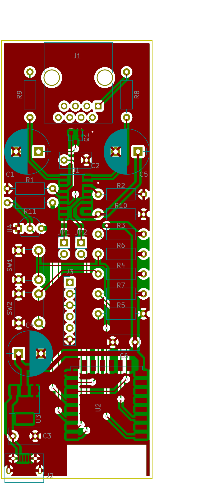

# Electrical Design

## Explained
This design uses the [Texas Instruments TS721](http://www.ti.com/product/TSS721A) circuit for the M-bus to TTL conversion. From here, the 3.3V TTL signal is taken to the [ESP-12](http://www.esp8266.com/wiki/doku.php?id=esp8266-module-family#esp-12) / [ESP8266](http://esp8266.net/) for further processing and reporting over WiFi to MQTT. Really, this hardware is agnostic to what you choose to report to, the HAN library will help you decode the serial signal into readable meter values.

An addition to this design is using a DS18B20 as a temperature sensor. Just a little added value in monitoring the temperature of your fuse box.

There is an on-board programming option for the ESP. In order to do programming, my experience is that you'll be better off disconnecting the RX/TX from the TSS721, so there's two jumpers for this.

Other than this, it's all about software. You can find the [Arduino code](../../Code) to decode the HAN data and report the values over WiFi to an MQTT server.

## Schematics

## PCB

### Layers
| Top Copper | Bottom Copper | Silk | Combined |
| ---------- | ------------- | ---- | -------- |
|  |  |  |  |

## Source Code
The full KiCad source for these design files are here in this folder. Download this repository, start KiCad, chose open project and select HAN_ESP_TSS721.pro to get going.

## Componenet list
| Name | Value | Part | Comments |
| -----| ----- | ---- | -------- |
C1|220uF / 16V|[UVR1C221MED1TA](https://www.digikey.no/product-detail/en/nichicon/UVR1C221MED1TA/493-6096-1-ND/3438470)     | Electrolytic Capacitor |
C2|100nF / 63V         |[R82EC3100AA70J](https://www.digikey.no/product-detail/en/kemet/R82EC3100AA70J/399-5861-ND/2571296)           | Metal Film Capasitor |
C3|100nF / 63V         |[R82EC3100AA70J](https://www.digikey.no/product-detail/en/kemet/R82EC3100AA70J/399-5861-ND/2571296)           | Metal Film Capasitor |
C4|220uF / 16V|[UVR1C221MED1TA](https://www.digikey.no/product-detail/en/nichicon/UVR1C221MED1TA/493-6096-1-ND/3438470)     | Electrolytic Capacitor |
C5|220uF / 16V|[UVR1C221MED1TA](https://www.digikey.no/product-detail/en/nichicon/UVR1C221MED1TA/493-6096-1-ND/3438470)     | Electrolytic Capacitor |
C6|100nF / 63V         |[R82EC3100AA70J](https://www.digikey.no/product-detail/en/kemet/R82EC3100AA70J/399-5861-ND/2571296)           | Metal Film Capasitor |
R1 | 22k | [CF14JT22K0](https://www.digikey.no/product-detail/en/stackpole-electronics-inc/CF14JT22K0/CF14JT22K0CT-ND/1830383) | 0.25W resistor |
R2 | 470R | [CF14JT470R](https://www.digikey.no/product-detail/en/stackpole-electronics-inc/CF14JT470R/CF14JT470RCT-ND/1830342) | 0.25W resistor |
R3 | 10k | [CF14JT10K0](https://www.digikey.no/product-detail/en/stackpole-electronics-inc/CF14JT10K0/CF14JT10K0CT-ND/1830374) | 0.25W resistor |
R4 | 10k | [CF14JT10K0](https://www.digikey.no/product-detail/en/stackpole-electronics-inc/CF14JT10K0/CF14JT10K0CT-ND/1830374) | 0.25W resistor |
R5 | 10k | [CF14JT10K0](https://www.digikey.no/product-detail/en/stackpole-electronics-inc/CF14JT10K0/CF14JT10K0CT-ND/1830374) | 0.25W resistor |
R6 | 10k | [CF14JT10K0](https://www.digikey.no/product-detail/en/stackpole-electronics-inc/CF14JT10K0/CF14JT10K0CT-ND/1830374) | 0.25W resistor |
R7 | 10k | [CF14JT10K0](https://www.digikey.no/product-detail/en/stackpole-electronics-inc/CF14JT10K0/CF14JT10K0CT-ND/1830374) | 0.25W resistor |
R8 | 220R | [CF14JT220R](https://www.digikey.no/product-detail/en/stackpole-electronics-inc/CF14JT220R/CF14JT220RCT-ND/1830334) | 0.25W resistor |
R9 | 220R | [CF14JT220R](https://www.digikey.no/product-detail/en/stackpole-electronics-inc/CF14JT220R/CF14JT220RCT-ND/1830334) | 0.25W resistor |
R10 | 22k | [CF14JT22K0](https://www.digikey.no/product-detail/en/stackpole-electronics-inc/CF14JT22K0/CF14JT22K0CT-ND/1830383) | 0.25W resistor |
R11 | 4k7 | [CF14JT4K70](https://www.digikey.no/product-detail/en/stackpole-electronics-inc/CF14JT4K70/CF14JT4K70CT-ND/1830366) | 0.25W resistor |
U1 | TSS721 | [TSS721AD](https://www.digikey.no/product-detail/en/texas-instruments/TSS721AD/296-27127-5-ND/1910053) | M-bus tranciever |
U2 | ESP12-E | [ESP12](https://www.digikey.no/product-detail/en/adafruit-industries-llc/2491/1528-1438-ND/5761206) | ESP8266 SMT MODULE (Check e-bay for this one) |
U3 | LM1117-3.3 | [LD1117AS33TR](https://www.digikey.no/product-detail/en/LD1117AS33TR/497-1228-1-ND/586228) | 3.3V Voltage regulator |
U4 | DS18B20 | [DS18B20](https://www.digikey.no/product-detail/en/maxim-integrated/DS18B20/DS18B20-ND/420071) | Maxim Temp Sensor |
Q1 | BSS84 | [BSS84PH6433XTMA1](https://www.digikey.no/product-detail/en/BSS84PH6433XTMA1/BSS84PH6433XTMA1CT-ND/5410005) | P-FET transistor |
J1 | RJ45 | [54601-908WPLF](https://www.digikey.no/product-detail/en/amphenol-fci/54601-908WPLF/609-5081-ND/1488544)| RJ45 port
J2 | uUSB | [10118194-0001LF](https://www.digikey.no/product-detail/en/amphenol-fci/10118194-0001LF/609-4618-1-ND/2785382) | USB micro socket
J3 | 6-pin female header | [4320-01074-0](https://www.digikey.no/product-detail/en/murata-power-solutions-inc/4320-01074-0/811-2702-ND/2344918) | 6-pin female header
JP1 | | [XG8S-0241](https://www.digikey.no/product-detail/en/omron-electronics-inc-emc-div/XG8S-0241/Z5374-ND/4947394) | Jumper header
JP2 | | [XG8S-0241](https://www.digikey.no/product-detail/en/omron-electronics-inc-emc-div/XG8S-0241/Z5374-ND/4947394) | Jumper header
SW1 | Tactile Switch | [1825910-6](https://www.digikey.no/product-detail/en/te-connectivity-alcoswitch-switches/1825910-6/450-1650-ND/1632536) | Tactile Button
SW2 | Tactile Switch | [1825910-6](https://www.digikey.no/product-detail/en/te-connectivity-alcoswitch-switches/1825910-6/450-1650-ND/1632536) | Tactile Button
-   | | [STC02SYAN](https://www.digikey.no/product-detail/en/sullins-connector-solutions/STC02SYAN/S9000-ND/76372) | Unless you have these lying in your drawer, you'll need two

