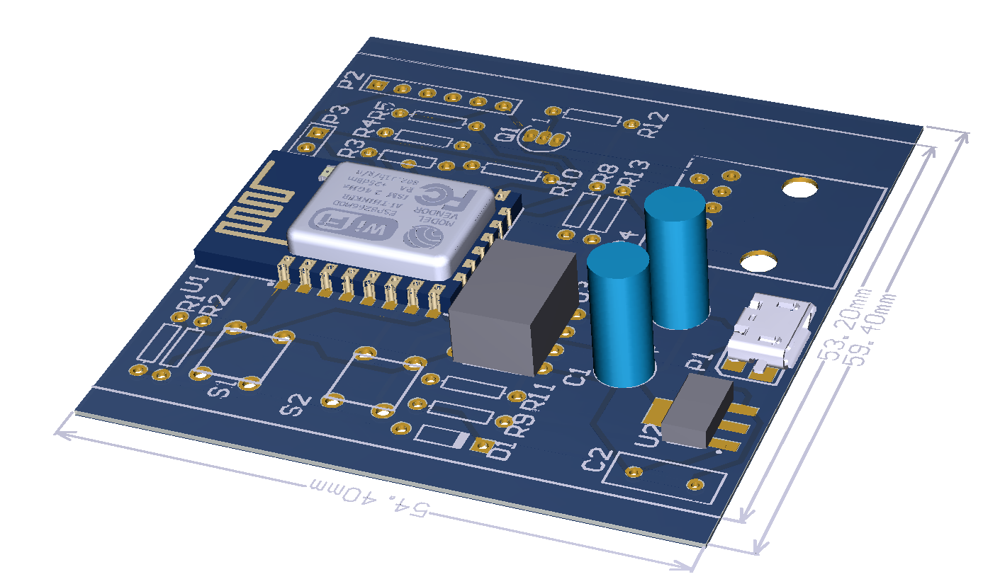

# Electrical Design

## Explained
The design is using an opamp as a compined level converter and a schmitt trigger, in order to convert 
the HAN signal into a 3.3V compatible serial format. As the input levels on the opamp is much higher 
than our 5V supply, we are rectifying and smoothing the HAN signal to use for a supply here. (VDD)

As a power source, we've used a micro USB connector, providing 5V, just as this is cheap and easy. However,
no part of the circuit will need any other power than the 3.3V, so any combination of power source and 
regulator that provides the 3.3V will do.

The ESP8266 setup is a rather standaraized setup and will allow for programming the ESP directly on the 
board, if needed. During programming, it might be neccessary to disconnect the incoming HAN.

## Schematics

## PCB

