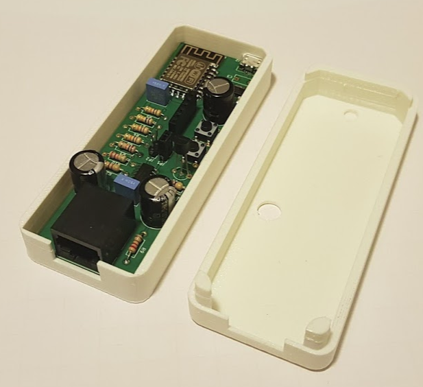
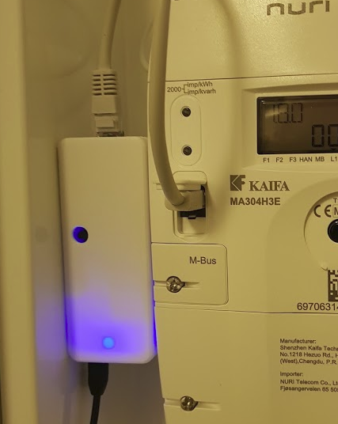

# AMS <-> MQTT Bridge
> This project may help you build your own reader for HAN data streamed from the new AMS electrical meters installed in Norway in 2017/2018. Data is read using an Arduino-programmed ESP8266 (in an ESP12 module from AI Thinker), then pushed to MQTT over WiFi. You can have full control over this data, and you can basically do anything with it. 
>
> This project does not include any fancy UI setup or even storage for the AMS data.
>
> *Building this project will require some skills in ordering and assembling  electronic circuits as well as programming, and I have not included detailed instructions to take a beginner through the steps. I still hope some still find information here useful, maybe also for other projects.*

## The completed hardware

*The completed board mounted in a [3D printed enclosure](/Electrical/HAN_ESP_TSS721/enclosure)*

*...and installed with the electrical meter*

## Background
The purpose of this project is to collect information and build a simplified bridge for reading serial DLSM/M-bus information from electrical power meters (AMS), provided over the HAN port, and publishing to some IoT friendly target.

Components will be ESP8622, Arduino code and an M-bus <-> 3.3V serial interface

As a start, we should try to get information from the three types of AMS meters currently being installed in Norway. Some details about these are available here: [NVE_Info_kunder_HANgrensesnitt.pdf](Documentation/NVE_Info_kunder_HANgrensesnitt.pdf)

Quite some work was put into parse and guess how the data protocol was defined. Unfortunately, I did not have access to the (rather expensive) standardization documentation, but with some collaborative effort we solved most details.

### This project includes

- [X] [Circuit to read MBus data, parse the DSLM and report to MQTT over WiFi](/Electrical/HAN_ESP_TSS721)
- [X] [Code to capture and analyze data from a PC](/Code/HanDebugger)
- [X] [Code to capture and analyze data from Arduino](/Code/ESPDebugger)
- [X] [Sample data from various meters](/Samples)
- [X] [Documentation on HAN / MBus / DLMS/COSEM](/Documentation)
- [X] [Code to parse DLMS data into a structure](/Code/Arduino/HanReader/src)
- [X] [Real schematics, including ESP8266](/Electrical/HAN_ESP_TSS721#schematics)
- [X] [PCB layout](/Electrical/HAN_ESP_TSS721#pcb)
- [X] [Component list](/Electrical/HAN_ESP_TSS721#componenet-list)
- [X] [Arduino library](/Code/Arduino)
- [X] [Complete Arduino sketch to read values and report to MQTT server](/Code/Arduino/AmsToMqttBridge)

[The completed project](/Code/Arduino/AmsToMqttBridge) also includes:

- Boot as Access Point and web server to allow config from a web browser. This allows you to set SSID, password, MQTT server and port, as well as topics for publish and subscribe
- On-board temperature sensor, also reported in json to MQTT

## Electrical design

The [most recent design](/Electrical/HAN_ESP_TSS721) uses an [ESP8266](http://esp8266.net/) in an ESP12 module from [AI Thinker](https://www.ai-thinker.com) for micro processing and the [TSS721](http://www.ti.com/product/TSS721A) from Texas Instruments for level conversion from M-Bus to TTL (3.3V). An earlier design solved the level conversion using an op-amp, which might be an easier and more available solution, but also more error-prone. See more details in [electrical design](./Electrical).
